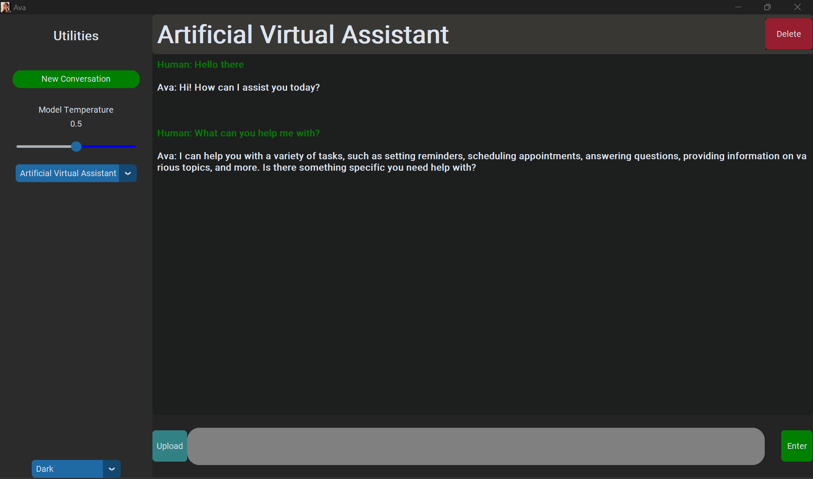

# Ava: Your Personal GPT Artificial Virtual Assistant



This is a personal project done over a period of 2 weeks for the MVP, to leverage on the insanely game-changing LLM model openai ```gpt-3.5-turbo``` and the open-source ```langchain``` library. The application is written in Python and built using ```customtkinter``` library to create a modern UI.


## Note:
As the import libraries were not optimised to ensure the quickest launch time, please wait for a bit when launching the app.

On first launch, an api set up window will be launched alongside with the main app. Please input your openai key(for general chat functionality).

You can get your key here:
* [Get your openai API key](https://platform.openai.com/)


### Features Implemented
* Ability to use internet using ```/websearch``` command


* Ability to upload your own PDF and have a QA with Ava on information from your PDF

* Ability to just use regular chat with Ava!

* Ability to save conversations to continue when relaunching app

### Features wishlist
* Ability to autonomously research on topics for you

* Ability to use speech instead of text for inputs

* Ability to use speech outputs for Ava

* Ability to switch betweeen LLM models

* Prompt templates section for easy setup of personality of Ava.


### Requirements
1. Windows 10/11 installed.
